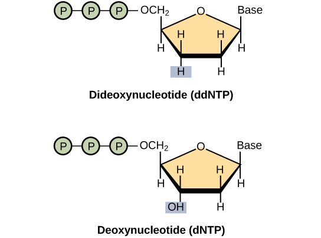
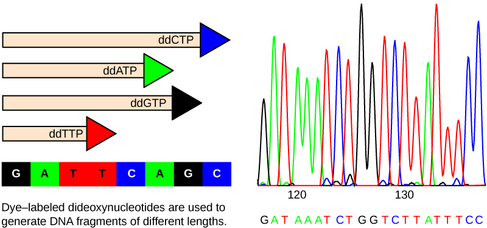

## DNA Sequencing: Overview

The ability to sequence DNA is one of the greatest achievements of the field of Biology. 

We will talk today about some of the history of DNA sequencing and the main technologies involved today.

Topics:

Traditional Technology
+ Sanger Sequencing 
+ The Human Genome Project

Massively Parallel DNA Sequencing (formerly Next Generation Sequencing)
+ Illumina
+ PacBio
+ NanoPore


--- 

## Sanger

Dr. Frederick Sanger (1918-2013) -- Developed sequencing by the chain terminating dideoxynucleotide method that now carries his name.
[
```{r echo=FALSE, out.width='30%', fig.align='center'}

```
](https://en.wikipedia.org/wiki/Frederick_Sanger#/media/File:Frederick_Sanger2.jpg)

---


## Sanger

```{r echo=FALSE, out.width='50%', fig.align='center'}

```

[Image credit: "Whole-genome sequencing: Figure 1," by OpenStax College, Biology (CC BY 4.0)](https://cnx.org/contents/GFy_h8cu@10.7:5l844Z38@7/Whole-Genome-Sequencing)

---

## Sanger

```{r echo=FALSE, out.width='50%', fig.align='center'}

```

[Image credit: "Whole-genome sequencing: Figure 1," by OpenStax College, Biology (CC BY 4.0)](https://cnx.org/contents/GFy_h8cu@10.7:5l844Z38@7/Whole-Genome-Sequencing)

---


## Sanger

<div align="center">
<iframe width="560" height="315" src="https://www.youtube.com/embed/FvHRio1yyhQ?rel=0"; frameborder="0" allowfullscreen></iframe>
</div>

---


## Sanger

<div align="center">
<iframe width="560" height="315" src="https://www.youtube.com/embed/e2G5zx-OJIw?rel=0"; frameborder="0" allowfullscreen></iframe>
</div>

---

## Sanger

Produces high quality reads
+ Length: 400-600 bp (sometimes longer to ~1kbp)
+ High base call accuracy (>95% and relatively easy to detect).
+ Maxes out at about 384 reads per run on typical equipment (some of this can be automated) due to lab infrastructure constraints.
+ A few hours per run
+ [Applied Biosystems](http://www.ramaciotti.unsw.edu.au/wp-content/uploads/2016/08/sequencing_handbook_FLR.pdf) equipment

How many runs at 500bp per read and (let's assume) 384 reads per run would it take to sequence the human genome at 3 billion bases one time?

---

## Human Genome Project


```{r echo=FALSE, out.width='100%', fig.align='center'}
knitr::include_graphics('./images/hgp_timeline.jpg')
```

[Source CC-by-2.0](https://www.flickr.com/photos/genomegov/26964377742/)

[It was a BIG deal!](https://www.youtube.com/watch?v=slRyGLmt3qc)

---

--- .segue 

# Current Sequencing Technology: 

---


## Illumina

<div align="center">
<iframe width="560" height="315" src="https://www.youtube.com/embed/fCd6B5HRaZ8?rel=0"; frameborder="0" allowfullscreen></iframe>
</div>

---

## PacBio

<div align="center">
<iframe width="560" height="315" src="https://www.youtube.com/embed/TwN9EaDtgjU?rel=0"; frameborder="0" allowfullscreen></iframe>
</div>

---

## PacBio
<div align="center">
<iframe width="560" height="315" src="https://www.youtube.com/embed/NHCJ8PtYCFc?rel=0"; frameborder="0" allowfullscreen></iframe>
</div>

---


## Ion Torrent

<div align="center">
<iframe width="560" height="315" src="https://www.youtube.com/embed/WYBzbxIfuKs?rel=0"; frameborder="0" allowfullscreen></iframe>
</div>

---

## Oxford Nanopore

<div align="center">
<iframe width="560" height="315" src="https://www.youtube.com/embed/E9-Rm5AoZGw?rel=0"; frameborder="0" allowfullscreen></iframe>
</div>

---

--- 

## More Nanopore

<iframe src="https://player.vimeo.com/video/297106166" width="640" height="360" frameborder="0" webkitallowfullscreen mozallowfullscreen allowfullscreen></iframe>
<p><a href="https://vimeo.com/297106166">Introduction to nanopore sequencing</a> from <a href="https://vimeo.com/user5318092">Oxford Nanopore</a> on <a href="https://vimeo.com">Vimeo</a>.</p>

---


## Other Resources

Library prep and Illumina Seq: http://rmpiro.net/teaching/pub/lectures/fu-genomics/01-NGS_technology.pdf

Review of sequencing platforms (2017):
https://www.omicsonline.org/open-access/generations-of-sequencing-technologies-from-first-to-next-generation-0974-8369-1000395.php?aid=87862


---

--- .segue 

# Questions? 
[home](https://rsh249.github.io/applied_bioinformatics)

---
