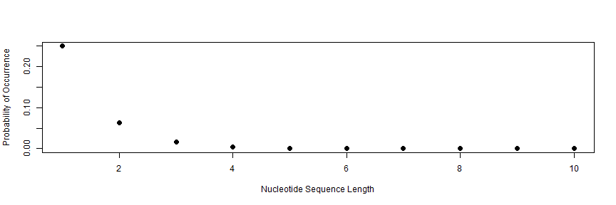

Longreads vs. Shortreads
========================================================
author: Prof. Harbert
date: 
autosize: true

Dividing Modern DNA sequencing technologies
========================================================

"Short read" Technology includes:
- Illumina platforms (Sequencing by Synthesis)
- Ion Torrent

***

"Long read" Technology includes:
- Pacific Biosciences (PacBio)
- Oxford Nanopore

*Long read technology is sometimes called "Third Generation Sequencing" and sometimes separated into Third and Fourth gen.

Suggested Readings
========================================================

https://www.genengnews.com/insights/the-long-and-the-short-of-dna-sequencing/

Slide With Plot
========================================================

