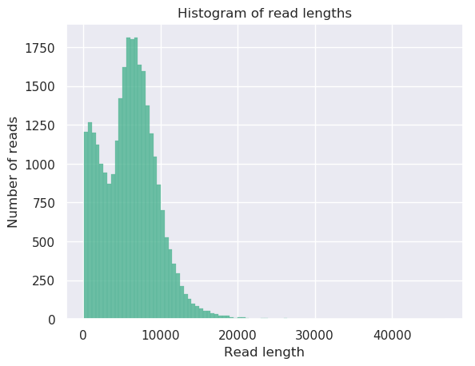
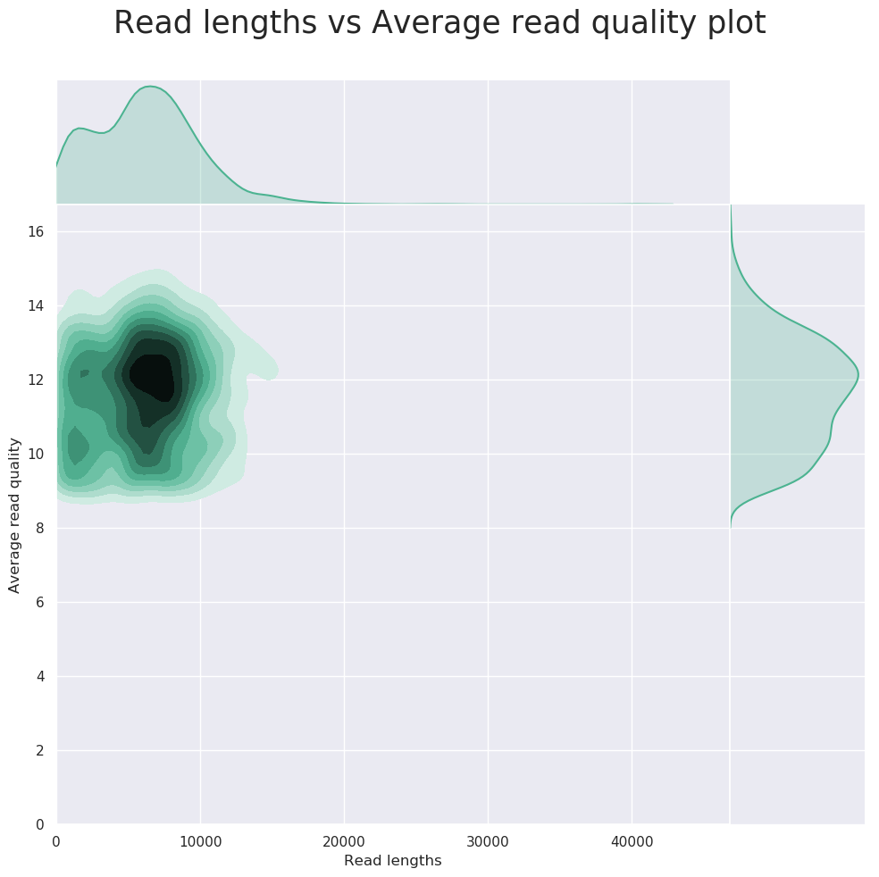

Quality Control for Nanopore Data
========================================================
author: Prof. Harbert
date: 11 March, 2019
autosize: true
transition: rotate

First
========================================================

Presentations Thursday. Give us the 5 minute pitch for your project covering:

- What questions the study is asking?
- What data did they collect?
- Show at least one figure from the paper that aims to answer the main questions.
- Present the flow of analyses/programs used. (A flow chart might be nice)

Nanopore Quality
========================================================

We will be exploring Nanopore read quality and filtering. This is always an important step with any sequencing data.

Common QC Steps:

- Read length distribution
- Data complexity/kmer counting
- Quality score mapping (usually by read length, but in Nanopore also possible through time with raw data)
- Adapter sequence removal
- Detect duplicates

QC Software
========================================================

In the wider world of Bioinformatics the king of QC is [fastqc](https://www.bioinformatics.babraham.ac.uk/projects/fastqc/). 

However, fastqc has trouble with Nanopore data and ONT specific tools exist.

Tools:
- [MinIONQC](https://github.com/roblanf/minion_qc) -- Operates directly on the summary files, not the fast5 or fastq. 
- [NanoPlot](https://github.com/wdecoster/NanoPlot) / [NanoStat](https://github.com/wdecoster/nanostat) / [NanoFilt](https://github.com/wdecoster/nanofilt)
- [poretools](https://academic.oup.com/bioinformatics/article/30/23/3399/207172) -- output some quality stats, also converts to other file types.
- Others??

NanoStat
========================================================

Example run:


```bash
NanoStat --fastq $datapath/SRR5805004.fastq > ns.file
```

NanoStat -- Output
========================================================


```bash
General summary:
Mean read length:               6,089.3
Mean read quality:                 11.6
Median read length:             6,101.0
Median read quality:               11.7
Number of reads:               29,280.0
Read length N50:                7,783.0
Total bases:              178,296,024.0
Number, percentage and megabases of reads above quality cutoffs
>Q5:    29280 (100.0%) 178.3Mb
>Q7:    29280 (100.0%) 178.3Mb
>Q10:   24456 (83.5%) 151.5Mb
>Q12:   12284 (42.0%) 78.3Mb
>Q15:   243 (0.8%) 1.7Mb
Top 5 highest mean basecall quality scores and their read lengths
1:      16.7 (2228)
2:      16.7 (8360)
3:      16.7 (5289)
4:      16.6 (3013)
5:      16.6 (8902)
Top 5 longest reads and their mean basecall quality score
1:      46833 (10.9)
2:      40311 (14.1)
3:      35785 (11.8)
4:      33627 (9.6)
5:      31740 (12.6)
```


NanoPlot
========================================================

Visualize quality metrics


```bash
NanoPlot --fastq $datapath/SRR5805004.fastq --outdir nanoplots
```

[All output plots](images/nanoplots)

NanoPlot -- Read Length Distribution
========================================================



NanoPlot -- Quality vs. Read Length
========================================================




NanoFilt
========================================================

