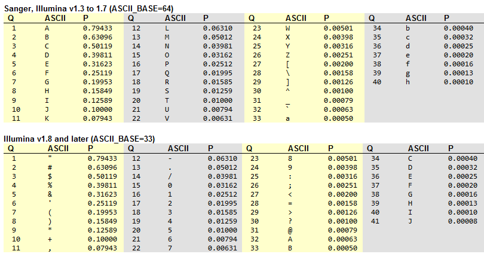

## Goals

Today we will:

+ View and discuss several file formats for storing and distributing DNA sequence data.
+ Visit and interact with some of the major repositories of sequence data


--- 


## But First ...


<div align="center">
<iframe width="560" height="315" src="https://www.youtube.com/embed/Eul1NlwytF4" frameborder="0" allow="accelerometer; autoplay; encrypted-media; gyroscope; picture-in-picture" allowfullscreen></iframe>
</div>


---


## Sequence Files: FASTA

+ The oldest file format currently in use and the default file for many applications.
+ Stores DNA, RNA, or Amino Acid sequence data only.

Consists of two parts:

+ A header line starting with ">", typically less than 80 characters but format is open.
+ Sequence data on one or more lines.
+ Multiple entries may be separated by two newlines.


---

## FASTA

Adapted from: https://zhanglab.ccmb.med.umich.edu/FASTA/

Stands for "FAST-All"

Files usually end in '.fa' or '.fna'

Looks like:

```{bash, eval=F}
>gi|186681228|ref|YP_001864424.1| phycoerythrobilin:ferredoxin oxidoreductase
MNSERSDVTLYQPFLDYAIAYMRSRLDLEPYPIPTGFESNSAVVGKGKNQEEVVTTSYAFQTAKLRQIRA
```

The header line typically contains some metadata about the sequence: What it is, where it came from, and any ID numbers associated with that sequence.


---

## Nucleic Acid Coding

```{bash, eval=F}
        A --> adenosine           M --> A C (amino)
        C --> cytidine            S --> G C (strong)
        G --> guanine             W --> A T (weak)
        T --> thymidine           B --> G T C
        U --> uridine             D --> G A T
        R --> G A (purine)        H --> A C T
        Y --> T C (pyrimidine)    V --> G C A
        K --> G T (keto)          N --> A G C T (any)
                                  -  gap of indeterminate length
```

Normally you will only see A,C,G,T, N (undetermined) and - (gap). 

Rarely R/Y Coding is used to simplify some analyses. 

Other ambiguous base characters are almost never used, but are accepted convention.

Gap characters (-) are usually assumed to represent single base, but notice that this is coded as "Gap of indeterminate lenght". So it is NOT always safe to assume (-) represents a single missing base.


---

## Amino Acid Coding

Though we are unlikely to see amino acid sequences in this class you should be able to recognize when the 20 letter AA code is being used.

```{bash, eval=F}
  Letter Code Name
    A ALA alanine                         P PRO proline
    B ASX aspartate or asparagine         Q GLN glutamine
    C CYS cystine                         R ARG arginine
    D ASP aspartate                       S SER serine
    E GLU glutamate                       T THR threonine
    F PHE phenylalanine                   U     selenocysteine
    G GLY glycine                         V VAL valine
    H HIS histidine                       W TRP tryptophan
    I ILE isoleucine                      Y TYR tyrosine
    K LYS lysine                          Z GLX glutamate or glutamine
    L LEU leucine                         X     any
    M MET methionine                      *     translation stop
    N ASN asparagine                      -     gap of indeterminate length
```

---

## fastq

A relative of the FASTA file format is the fastq, where 'q' stands for quality. 

fastq is a more complex and information rich file format that became necessary when people figured out how to measure base quality on raw sequence data. https://en.wikipedia.org/wiki/Phred_quality_score

Files end in '.fq' or '.fastq'

The format consists of 4 lines:

```{bash, eval=F}


@SIM:1:FCX:1:15:6329:1045 1:N:0:2
TCGCACTCAACGCCCTGCATATGACAAGACAGAATC
+
<>;##=><9=AAAAAAAAAA9#:<#<;<<<????#=

```

---

## fastq (cont.)

The header line always starts with an '@' and can contain information about the sequencing protocol. Usually ends in a read number or ID.

Line 2 is always the sequence itself using the same coding as before.

Line 3 is always a '+'

Line 4 is the quality string where each character encodes a quality score for each base in the sequence.

[More info here](http://support.illumina.com/content/dam/illumina-support/help/BaseSpaceHelp_v2/Content/Vault/Informatics/Sequencing_Analysis/BS/swSEQ_mBS_FASTQFiles.htm)

---


## Quality scores: Phred

fastq is the default file format for all Illumina sequencing. The default quality scoring for modern Illumina platforms is known as Phred33.

This is what all those symbols mean in Phred:

[
```{r echo=FALSE, out.width='70%', fig.align='center'}

```
](http://www.drive5.com/usearch/manual7/quality_score.html)


---

## Visualizing Quality

For Illumina and Sanger sequencing the common program to analyze DNA sequence read quality is called FastQC

http://www.bioinformatics.babraham.ac.uk/projects/fastqc/

---

## Nanopore: Fast5

ONT applications all use and create Fast5 files.

Fast 5 is an application of the [HDF5 standard](https://support.hdfgroup.org/HDF5/doc/Specs.html)

These are 'binary' database files that require special software tools to read the data. This means two things:

+ Fast5 is an information rich and flexible format that provides an efficient data/metadata storage platform.

+ we cannot "see" the Fast5 files directly (i.e., using 'cat' or 'nano')


We will look at some of the tools for viewing and extracting data from Fast5 in a later session.


---

## Major Sequence Data Archives

There are two places that you should go to if you want to find published sequence data: (NOTE: We will be searching these for reference data for our Nanopore projects)

1) The US NCBI databases: https://www.ncbi.nlm.nih.gov/ (includes Genbank)


2) The European EMBL databases: https://www.ebi.ac.uk/


What kind of files do we recover from these searches?

(Hint: Fast5 [here](https://www.ebi.ac.uk/ena/data/view/PRJEB20906))

---

## Next: Nanopore Community 

You should all have received and email to join my Nanopore Community group.

https://community.nanoporetech.com/

---


--- .segue 

# Questions? 
[home](https://rsh249.github.io/applied_bioinformatics)

---
