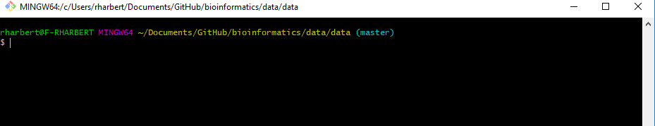

```{r setup, include=F}
knitr::opts_chunk$set(echo = TRUE)
```


[home](https://rsh249.github.io/applied_bioinformatics)


# The Unix Shell: A fundamental tool for bioinformatics

Outline:

+ What is the Unix shell? (What's Unix? What's a shell?)
+ Interacting with the shell
+ Moving in and viewing your filesystem
+ Files (create, edit, delete)
+ Parsing text (search and bulk edit files - read, search, sort, and rearrange files)


## What is the Unix Shell?

The shell provides an environment to interact with your computer on a more fundamental level than we are used to. It does this by implementing a simple "language" that we can learn to communicate with our machines through a command-line interface. The typical shell is known as Bash (the Bourne Again Shell).

The command-line runs a Read-Evaluate-Print-Loop operation that is the core of everything we do there. This is essentially what the RStudio Console window does for us in the context of R.

The command-line looks something like this:

```{bash, eval=F}
username@machine /path/to/where/you/are $
```

```{r echo=F, out.width='90%', fig.align='center'}

```

And we interact with the shell by typing a command after the $:

```{bash, eval = F}
pwd
```

What did that do?

## Finding out about your file system: ls, pwd, cd

ls -- List what is in your current directory.

```{bash, eval = F}
ls

ls -a

ls -l
ls -lh
```

### Find help:

All command line programs/commands should** have a help file associated with them. We can view those in one of two ways:

```{bash, eval = F}
ls --help
#or
man ls


```

### Where am I?

pwd -- print working directory/folder

```{bash, eval =F}
pwd

```


### Move to somewhere else

cd -- change working directory

```{bash, eval=F}
# cd into one of the directories you see when you type
ls -F

cd Desktop

# to go up a level (Back usually)

cd ..

# To navigate to your home directory

cd ~
#or
cd


```


## Files - Create, edit, delete files and directories

With: mkdir, nano, touch, cp, mv, rm, rmdir, cat, head, less

Let's make a new folder in our current directory to play in:

### mkdir - make directory
```{bash, eval=F}
mkdir data
cd data

ls -l

```


There is nothing there because we just created that directory. To make a new file we can use:

### touch - create file

```{bash, eval=F}
touch textfile
```


### nano -- comman line text editor

OR a text editor 'nano'. Be sure to put some text into the nano editor and save before closing.

```{bash, eval=F}
nano newfile
```

Use Ctrl+X to close nano and follow the prompts at the bottom of your terminal if needed.

### cp -- copy

Let's say we want to make a backup of newfile. We can use 'cp':

```{bash, eval =F}
#Copy with cp
cp newfile backup
```

### cat/head -- for printing

We can do some simple viewing of files with commands 'cat' and 'head'. 

```{bash, eval=F}
cat newfile
head newfile

```

### wc -- Word Count

And gather basic file statistics (word, line, and character counts) with 'wc':

```{bash, eval=F}
wc -l newfile
```

### mv, rm, rmdir -- Move and remove/delete

Or maybe we want to move a file to a new place

```{bash, eval=F}

mkdir backdir
mv backup backdir

```

All of that was junk so let's clean up after ourselves by removing the files we made with 'rm' and then the backdir directory with 'rmdir'

```{bash, eval=F}
rm textfile
rm newfile
rm backdir/backup
rmdir backdir
```

NOTE: 'rm' is FOREVER. Be very sure you understand how rm behaves before pressing ENTER.

One dangerous error people make is using anasterisk with rm. In unix the asterisk is a "wildcard" character and means anything in the scope of your command will be included. In the case of rm that means you will delete a lot of files that you may not have intended to target.


## Accessing a remote server

For this course we will be working mostly on a remote compute resource. To access the command line on that machine you will need to use the 'ssh' (secure shell) utility. This creates an encrypted connection between your shell and the operating system on the remote resource.

```{bash, eval=F}

ssh yourusername@ip.of.the.day

```

Enter your password when prompted and pay close attention to what your prompt looks like.

If all went right you should now attempt to access the shared text files we will be using for the rest of today's class.

```{bash, eval=F}

head -1 /usr/share/data/shell_files/test.txt

```

If that works now you can copy that file to your working directory. (Hint: "./" is code for whatever diretory you are currently in)

```{bash, eval=F}
cp /usr/share/data/shell_files/test.txt ./
```

## Searching and manipulating text files: grep and sort


We can do some basic exploration: (one command at a time!)
```{bash, eval=F}
wc -l test.txt
head test.txt
head -20 test.txt
less test.txt #end with 'q'
cat test.txt 
ls -lh
```

Does this text look familiar? How can we figure out what we have? Why has your instructor made this so difficult?

### grep

A command you all NEED to know that helps search through big files is 'grep'. Once again R has a grep() function that works on similar principles. Unix grep is one of the most used tools in bioinformatics data exploration.

```{bash, eval=F}
grep --help
grep "the" test.txt #print all lines with the word "the"
grep -c "the" test.txt # count lines matching "the"
grep -cw "the" test.txt # why is this different?

```

Things can get more complicated with [Regular Expressions](https://www.cyberciti.biz/faq/grep-regular-expressions/) but for now (until we start working with FASTA and fastq files) we will deal only in whole strings of characters.

It looks like this file is some Shakespeare play. But which one? Let's try to grep out some key words that could help us figure it out:

```{bash, eval=F}
grep -i "romeo" test.txt
```

Nope....

```{bash, eval=F}
grep -i "othello" test.txt
grep -i "henry" test.txt
grep -i "lear" test.txt
grep -i "petruchio" test.txt
```

hmm... What do we have?

We have a scrambled text file that is a collection of Shakespeare plays. Can we sort this file out and make it readable again? YES! Better living through the power of Unix!


### sort

The 'sort' command does (sometimes) exactly what it sounds like. This file that we have looks like it has line numbers at the start of every line. Let's see if that is the case:

**the ">" here redirects the output into a new file. This is REALLY USEFUL.

```{bash, eval=F}
sort test.txt > sort.txt
head sort.txt
```

Not quite. Check sort --help and see if you can fix it!

## Scripting

Any time you are typing code that you may want to run again you need to consider a script. So you should always write code in scripts even if only because you will make errors in your typing that will be easier to correct if you have the command saved somewhere.

Scripts are simply text files (not formatted files like those created by Word) that contain a set of commands that you want to save and run again. Scripts are useful in all of the coding languages that we will see in this course (bash, R, Python) but be sure not to mix languages.


Let's write a simple 'bash' script to generate some statistics about our test.txt file:

First, open a new document in nano:

```{bash, eval=F}

nano script1

```

Then add content:

```{bash, eval=F}

#this is a comment

#echo will print something back to the the terminal when the script is run
echo 'Word Count\n' 

#then we can run any command that we ran on the command line before
wc test.txt

sleep 3 # pauses the script for 3 seconds

head -5 test.txt

sleep 3

#find Romeo
grep -i "romeo" test.txt

#The script will end when there are no more commands to run. Some languages require an explicit "quit" or "exit" command. Bash likes 'exit' so you can use that if you wish.

exit

```

Then quit nano with a Ctrl+'o' and Ctrl+'x'

Now we can test run our script:

```{bash, eval=F}

bash script1

```

What output do we get?

# For further reading: The GNU project

https://www.gnu.org/gnu/thegnuproject.en.html

# Unix cheatsheets

http://cheatsheetworld.com/programming/unix-linux-cheat-sheet/

https://files.fosswire.com/2007/08/fwunixref.pdf


[home](https://rsh249.github.io/applied_bioinformatics)
